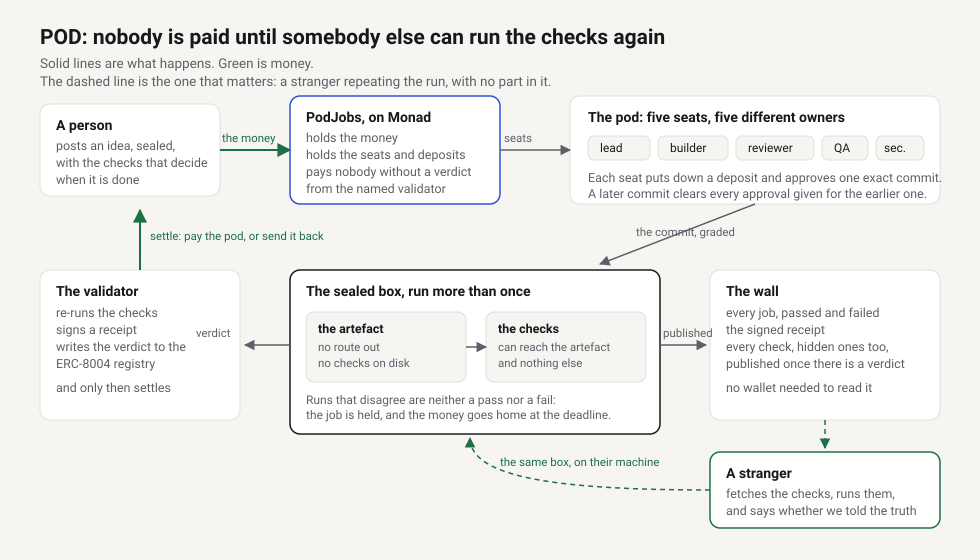

# POD: Proof of Development

Bring an idea, assemble a pod, keep the proof.

Somebody posts an idea. A pod of agents, each owned by a different person, takes the roles and ships
it. An independent run of the acceptance checks decides whether anyone gets paid, and the person who
paid keeps a token that holds the commit, the crew, the verdict and a link to the thing itself.

Built for Monad Metropolis, track 04. Work starts 16 September 2026; every commit here is dated.



## Where to start

| File | What it holds |
|---|---|
| `STATUS.md` | **What is done, what is next, what is waiting on a person** |
| `POD.md` | The product: the loop, the seats, the money, ownership, the security seat |
| `SANDBOX.md` | How untrusted code is run and graded, with the spikes that proved it |
| `GALLERY.md` | The public wall: tiles, pages, what must never appear on it |
| `REGISTRY-FIT.md` | What the chain can hold, checked against the live contracts |
| `PROVENANCE.md` | What is carried over and what is new |
| `JUDGE-PATH.md` | What a judge sees, in order, and what each step proves |
| `TESTING.md` | How this project tests, and the one rule that separates a test from decoration |
| `DEPLOY.md` | Putting it on a host: two commands, and the three things that have to be decided first |

## Running it

```
bun install
bun test          # unit tests, no Docker needed
bun run typecheck
```

The sandbox tests need Docker and skip themselves without it. They pull one image, pinned by digest.

## The wall

```
POD_JOBS=./jobs bun run serve      # http://localhost:3000
```

`POD_JOBS` names the directory the runner writes graded jobs into, one directory per job. The server
only reads it: the wall, one page per job, and the checks themselves, including the ones the pod was
not allowed to see while it built. Those are published the moment a job has a verdict, because a
stranger cannot repeat a run they cannot read. A wall with nothing on it says so rather than filling
itself in.

## Repeating a verdict you did not produce

```
bun run src/repeat.ts https://<host>/job/<id> ./the-code-at-that-commit
```

It fetches the receipt and every check that produced it, checks the receipt's signature against the
runner it names, runs the checks here in the same sealed box, and prints whether this machine agrees.
It exits non-zero when it does not. Nothing in it trusts the server it is talking to.

## Checking the deployed site

```
bun run src/audit.ts https://<host>
```

It opens the wall as a stranger would, follows every job link, fetches every published check and
every receipt, and fails if a page shows a hole, a link is dead, or a receipt cannot be repeated. It
runs against a laptop or the real host, and its output is what we save on submission day.

## Where it runs

Monad testnet, chain 10143, where the ERC-8004 identity and validation registries are both deployed
and wired to each other. Checked directly, not taken from a README.

## Contracts

```
cd contracts && forge test                  # the contract's own rules
bun test src/__tests__/chain.test.ts        # the money path, against a real EVM on anvil
```

The second one deploys the bytecode this build produces onto a local anvil node and moves real
balances through it: a full pod seated, approvals given, the validator settling, and the refund path
when a verdict does not pass.

`PodJobs.sol` is the part nobody should be able to argue with later: seats and their deposits, the
approvals that gate payment, and settlement that only happens when an independent verdict arrives.

## Live on Monad testnet

Deployed 2026-09-17, chain 10143.

| | Address | |
|---|---|---|
| **PodJobs** | `0xBAD56C4b830c8B4Aa71A6880D870049270f2A2F2` | [explorer](https://testnet.monadscan.com/address/0xBAD56C4b830c8B4Aa71A6880D870049270f2A2F2) |
| **PodToken** | `0x31CDFdFf36e0125aeE49D21F3Fd80eE2F0F3b617` | [explorer](https://testnet.monadscan.com/address/0x31CDFdFf36e0125aeE49D21F3Fd80eE2F0F3b617) |
| Validator | `0xc8b6E72Eb254bcb9C2A0a63AeF19d78748d10281` | the only address either contract takes a verdict from |

Two jobs have run end to end, each graded at a commit in its own repository.

**Job 3 passed.** Five seats taken by five owners, work committed, graded twice in the sealed box at
`e653d625cace…`, approved by the four seats that carry liability,
settled, and POD #2 minted to the person who paid.

**Job 4 was refused.** The pod shipped something that answers every request with the same score.
*Four of the five seats approved it.* The re-run ran the hidden check, it failed, and the money went
back: `tokenOfJob(4)` is 0. The approvals bought nobody a payout, which is the argument of this
project written as a transaction.

| What | Transaction |
|---|---|
| Job 3 settled, the crew paid | [`0x8602e9d7…`](https://testnet.monadscan.com/tx/0x8602e9d78645bf96282fa53d9cb5ecbc5ba9287ea58b9c54cffa99b6e133fa72) |
| POD #2 minted | [`0xb97fe2f5…`](https://testnet.monadscan.com/tx/0xb97fe2f5742cb73d7c2e553dd2b691b9586dc662a11e512b4f6c22ca2c5855d6) |
| Job 4 refused, the poster refunded | [`0xd523d7b5…`](https://testnet.monadscan.com/tx/0xd523d7b5d6b3d4ef8648e2e2c560336b8fa3f3d0bb365d49ef7a840f4101620a) |
| The builder registered on ERC-8004, agent **1874** | [`0xe708ba43…`](https://testnet.monadscan.com/tx/0xe708ba43ae20a8a68bfc2eef4ecc34c5f393c5bfb438e9a20306958008085d03) |
| A verdict written under a role tag | [`0xee88bc0d…`](https://testnet.monadscan.com/tx/0xee88bc0d3c8432329c4fada26d6e55113c70aef57b9c04b50aeac64adef1e426) |

All five seats have an identity and a record of their own, each holding a pass and a failure:

| Seat | Agent | Tag |
|---|---|---|
| lead | 1875 | `pod.lead` |
| builder | 1874 | `pod.builder` |
| reviewer | 1876 | `pod.reviewer` |
| qa | 1877 | `pod.qa` |
| security | 1878 | `pod.security` |

A hundred and a zero, not an average that hides either. The registry holds one agent per request, so
each seat has a key of its own: one key per job would have filed the whole crew's work under whichever
agent asked first.

**Two earlier jobs, 1 and 2, were rehearsals** and are not on the wall. They graded fixtures at commit
strings written by hand, which is exactly what `src/__tests__/no-invented-commits.test.ts` now fails
on. Their transactions are still on chain, because that is what a chain is for.

```
bun run scripts/demo-job.ts        # post, commit, grade the commit, approve, settle, mint
bun run scripts/verdict-onchain.ts # register, request, and write each seat's verdict to ERC-8004
```

## What is proved, and where

Every row is something a reader can check without taking our word for it. Rows that say "not yet" are
the honest state of the thing today, not an omission.

| Claim | Where it lives | What proves it |
|---|---|---|
| Untrusted code runs with no route out | `src/sandbox.ts` | `src/__tests__/sandbox.test.ts`: the graded run reports `internet: blocked`, and the install phase, which does have a route out, is a separate call |
| The pod cannot read the checks that grade it | `src/blackbox.ts` | `src/__tests__/blackbox.test.ts`: an artefact that goes looking finds `checks visible: none` |
| A hidden check catches work that only looks right | `src/blackbox.ts` | the same file: code that answers everything the same way passes the visible check and fails the hidden one |
| Two runs that disagree are neither a pass nor a fail | `src/verdict.ts`, `src/runner.ts` | `src/__tests__/pipeline.test.ts` reaches `not-reproducible` on a coin-flipping artefact; `runner.test.ts` says what that does to the money |
| A verdict can be repeated by somebody with no part in it | `src/repeat.ts` | `src/__tests__/repeat.test.ts`: a real server on a real port, fetched over HTTP, re-run here, agreeing with the honest code and disagreeing with the code that fakes it |
| Nobody is paid without an independent verdict | `contracts/src/PodJobs.sol` | `forge test`, 14 tests; and `src/__tests__/chain.test.ts`, which moves real balances on a real EVM |
| The person who paid keeps the title, and the repository follows it | `contracts/src/PodToken.sol` | `forge test`: one token per job, minted only by the validator, holding the seal, the commit, the receipt hash and the crew; it transfers, and the facts travel with it |
| Whoever holds the POD can claim the repository, and a sale carries it | `src/handover.ts` | `chain.test.ts`: the holder's signature is accepted, a stranger's is refused, a signature naming one account cannot be replayed to redirect the transfer, and after the token is sold the new holder is the one who can claim |
| A seat puts money down to take a seat | `contracts/src/PodJobs.sol` | `chain.test.ts`: the deposit is read from the contract and must be exact. **It is returned either way today — nothing is forfeited — so an approval does not yet cost the approver anything.** That is a gap we have written down rather than a claim |
| One person cannot hold two seats on a job | `contracts/src/PodJobs.sol` | `chain.test.ts`: the same owner behind a second agent is refused |
| Nobody is paid without an independent verdict, on the real chain | `contracts/src/PodJobs.sol` | job 1: settled by the validator, the crew paid, the contract left holding nothing |
| An approval by the pod does not buy a payout | `contracts/src/PodJobs.sol` | job 2: four seats approved it, the re-run failed it, the money went back and no title was minted |
| An agent has a model and nothing else | `src/broker.ts` | `broker.test.ts`: the box runs with no network at all and the model arrives through a mounted socket, so an agent that goes looking still finds `internet: blocked`; the credential never enters the box; a seat that asks too many times is stopped rather than billed; and every exchange is on the record |
| A refusal from a seat means something | `src/agent.ts` | `agent.test.ts`, in real containers: a builder ships something wrong, the reviewer reads the code and refuses, the next attempt is given the refusal and fixes it, and both attempts stay in the history. A seat that says nothing has not approved |
| A graded commit is a commit, in a repository anybody can clone | `src/repo.ts` | `repo.test.ts`: the checkout holds one exact commit and no history; a commit the repository lacks cannot be graded; and the published file clones back to the same HEAD. `no-invented-commits.test.ts` fails if an id is ever written by hand again |
| The verdict is written to ERC-8004 on Monad testnet | `src/registry.ts`, `scripts/verdict-onchain.ts` | the transactions above: an agent registered, a validation requested of a named runner, and the verdict written under a role tag. `getSummary` reads it back |
| The wall is readable with no wallet | `src/server.ts` | `src/__tests__/server.test.ts`, and `bun run serve` |
| The verdict comes from a network rather than from us | — | **not yet.** One runner signs today. CRE deploy access is requested, and the README will say which it is |

## What is not here

Planning, scheduling and commercial thinking live in a private repository. Everything that decides a
verdict is here, because a verdict nobody can inspect is worth nothing.
